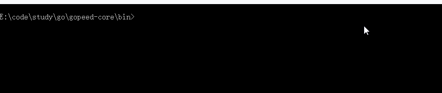

[](https://github.com/monkeyWie/gopeed-core/actions?query=workflow%3Atest)
[](https://codecov.io/gh/monkeyWie/gopeed-core)
[](https://github.com/monkeyWie/gopeed-core/releases)

## gopeed

支持多协议（HTTP、BitTorrent）下载的客户端，提供命令行、RESTful API、WebSocket、Go 类库方式来使用。

## 安装

```sh
go install github.com/monkeyWie/gopeed-core
```

## 示例

可以在本仓库的[\_examples](_examples)目录下查看

## 命令行工具

### 预览



### 下载

前往[releases](https://github.com/monkeyWie/gopeed-core/releases)页面

## TODO

- [x] HTTP 下载实现
- [ ] BitTorrent 下载实现
  - [x] .torrent 文件解析
  - [x] tracker 协议实现
  - [x] peer wire protocol 协议实现
  - [ ] DHT 协议实现
  - [ ] 磁力链接支持
  - [ ] uTP 协议实现
- [x] 下载接口抽象(不关心具体协议)
- [ ] 支持自定义配置
- [ ] 限速功能实现
- [x] 命令行工具提供
- [ ] RESTful 服务提供

## 参与

由于项目目前还未定型，代码可能随时有大的调整，所以暂不接受 PR，当然如果有什么好的想法可以在 issue 区提出来。
