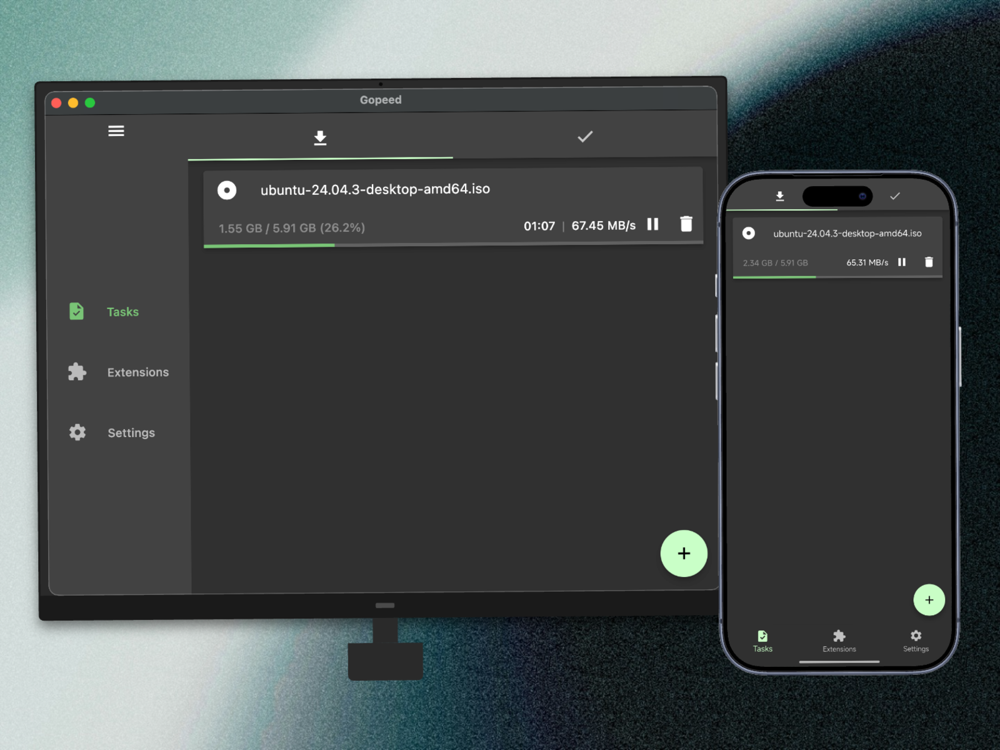

# [](https://gopeed.com)

[](https://github.com/GopeedLab/gopeed/actions?query=workflow%3Atest)
[](https://codecov.io/gh/GopeedLab/gopeed)
[](https://github.com/GopeedLab/gopeed/releases)
[](https://github.com/GopeedLab/gopeed/releases)
[](https://gopeed.com/docs/donate)
[](https://raw.githubusercontent.com/GopeedLab/gopeed/main/_docs/img/weixin.png)
[](https://discord.gg/ZUJqJrwCGB)

<a href="https://trendshift.io/repositories/7953" target="_blank"></a>

[](https://ko-fi.com/R6R6IJGN6)

[English](/README.md) | [中文](/README_zh-CN.md) | [日本語](/README_ja-JP.md) | [正體中文](/README_zh-TW.md) | [Tiếng Việt](/README_vi-VN.md)

## 🚀 はじめに

Gopeed (正式名 Go Speed) は `Golang` + `Flutter` によって開発された高速ダウンローダーで、(HTTP、BitTorrent、Magnet、ED2K) プロトコルをサポートし、すべてのプラットフォームをサポートします。基本的なダウンロード機能に加え、[APIs](https://gopeed.com/docs/dev-api)との連動や[拡張機能](https://gopeed.com/docs/dev-extension)のインストール・開発による追加機能にも対応した、カスタマイズ性の高いダウンローダーです。

見て下さい ✈ [公式ウェブサイト](https://gopeed.com) | 📖 [開発ドキュメント](https://gopeed.com/docs)

## ⬇️ インストール

<table>
  <tbody>
    <tr>
      <td rowspan="2">🪟 Windows</td>
      <td><code>EXE</code></td>
      <td>amd64</td>
      <td><a href="https://gopeed.com/api/download?tpl=Gopeed-$version-windows-amd64.zip">📥</a></td>
    </tr>
    <tr>
      <td><code>Portable</code></td>
      <td>amd64</td>
      <td><a href="https://gopeed.com/api/download?tpl=Gopeed-$version-windows-amd64-portable.zip">📥</a></td>
    </tr>
    <tr>
      <td rowspan="3">🍎 MacOS</td>
      <td rowspan="3"><code>DMG</code></td>
      <td>universal</td>
      <td><a href="https://gopeed.com/api/download?tpl=Gopeed-$version-macos.dmg">📥</a></td>
    </tr>
    <tr>
      <td>amd64</td>
      <td><a href="https://gopeed.com/api/download?tpl=Gopeed-$version-macos-amd64.dmg">📥</a></td>
    </tr>
    <tr>
      <td>arm64</td>
      <td><a href="https://gopeed.com/api/download?tpl=Gopeed-$version-macos-arm64.dmg">📥</a></td>
    </tr>
    <tr>
      <td rowspan="6">🐧 Linux</td>
      <td><code>Flathub</code></td>
      <td>amd64</td>
      <td><a href="https://flathub.org/apps/com.gopeed.Gopeed">📥</a></td>
    </tr>
    <tr>
      <td><code>SNAP</code></td>
      <td>amd64</td>
      <td><a href="https://snapcraft.io/gopeed">📥</a></td>
    </tr>
    <tr>
      <td rowspan="2"><code>DEB</code></td>
      <td>amd64</td>
      <td><a href="https://gopeed.com/api/download?tpl=Gopeed-$version-linux-amd64.deb">📥</a></td>
    </tr>
    <tr>
      <td>arm64</td>
      <td><a href="https://gopeed.com/api/download?tpl=Gopeed-$version-linux-arm64.deb">📥</a></td>
    </tr>
    <tr>
      <td rowspan="2"><code>AppImage</code></td>
      <td>amd64</td>
      <td><a href="https://gopeed.com/api/download?tpl=Gopeed-$version-linux-amd64.AppImage">📥</a></td>
    </tr>
    <tr>
      <td>arm64</td>
      <td><a href="https://gopeed.com/api/download?tpl=Gopeed-$version-linux-arm64.AppImage">📥</a></td>
    </tr>
    <tr>
      <td rowspan="4">🤖 Android</td>
      <td rowspan="4"><code>APK</code></td>
      <td>universal</td>
      <td><a href="https://gopeed.com/api/download?tpl=Gopeed-$version-android.apk">📥</a></td>
    </tr>
     <tr>
      <td>armeabi-v7a</td>
      <td><a href="https://gopeed.com/api/download?tpl=Gopeed-$version-android-armeabi-v7a.apk">📥</a></td>
    </tr>
     <tr>
      <td>arm64-v8a</td>
      <td><a href="https://gopeed.com/api/download?tpl=Gopeed-$version-android-arm64-v8a.apk">📥</a></td>
    </tr>
    <tr>
      <td>x86_64</td>
      <td><a href="https://gopeed.com/api/download?tpl=Gopeed-$version-android-x86_64.apk">📥</a></td>
    </tr>
    <tr>
      <td>📱 iOS</td>
      <td><code>IPA</code></td>
      <td>universal</td>
      <td><a href="https://gopeed.com/api/download?tpl=Gopeed-$version-ios.ipa">📥</a></td>
    </tr>
    <tr>
      <td>🐳 Docker</td>
      <td>-</td>
      <td>universal</td>
      <td><a href="https://hub.docker.com/r/liwei2633/gopeed">📥</a></td>
    </tr>
    <tr>
      <td rowspan="2">💾 Qnap</td>
      <td rowspan="2"><code>QPKG</code></td>
      <td>amd64</td>
      <td><a href="https://gopeed.com/api/download?tpl=gopeed-$version-qnap-amd64.qpkg">📥</a></td>
    </tr>
    <tr>
      <td>arm64</td>
      <td><a href="https://gopeed.com/api/download?tpl=gopeed-$version-qnap-arm64.qpkg">📥</a></td>
    </tr>
    <tr>
      <td rowspan="8">🌐 Web</td>
      <td rowspan="3"><code>Windows</code></td>
      <td>amd64</td>
      <td><a href="https://gopeed.com/api/download?tpl=gopeed-web-$version-windows-amd64.zip">📥</a></td>
    </tr>
    <tr>
      <td>arm64</td>
      <td><a href="https://gopeed.com/api/download?tpl=gopeed-web-$version-windows-arm64.zip">📥</a></td>
    </tr>
    <tr>
      <td>386</td>
      <td><a href="https://gopeed.com/api/download?tpl=gopeed-web-$version-windows-386.zip">📥</a></td>
    </tr>
    <tr>
      <td rowspan="2"><code>MacOS</code></td>
      <td>amd64</td>
      <td><a href="https://gopeed.com/api/download?tpl=gopeed-web-$version-macos-amd64.zip">📥</a></td>
    </tr>
    <tr>
      <td>arm64</td>
      <td><a href="https://gopeed.com/api/download?tpl=gopeed-web-$version-macos-arm64.zip">📥</a></td>
    </tr>
    <tr>
      <td rowspan="3"><code>Linux</code></td>
      <td>amd64</td>
      <td><a href="https://gopeed.com/api/download?tpl=gopeed-web-$version-linux-amd64.zip">📥</a></td>
    </tr>
    <tr>
      <td>arm64</td>
      <td><a href="https://gopeed.com/api/download?tpl=gopeed-web-$version-linux-arm64.zip">📥</a></td>
    </tr>
    <tr>
      <td>386</td>
      <td><a href="https://gopeed.com/api/download?tpl=gopeed-web-$version-linux-386.zip">📥</a></td>
    </tr>
  </tbody>
</table>
インストールについての詳細は、[インストール](https://gopeed.com/docs/install)を参照してください。

### 🛠️ コマンドツール

## 📱 WeChat 公式アカウント

公式アカウントをフォローして、最新のアップデートやニュースを入手してください。


## 💝 寄付

もしこのプロジェクトがお気に召しましたら、このプロジェクトの発展を支援するために[寄付](https://gopeed.com/docs/donate)をご検討ください！

## 🖼️ ショーケース



## 👨‍💻 開発

このプロジェクトは二つの部分に分かれており、フロントエンドでは `flutter` を、バックエンドでは `Golang` を使用し、両者は `http` プロトコルで通信する。ユニックスシステムでは `unix socket` を、ウィンドウズシステムでは `tcp` プロトコルを使用します。

> フロントコードは `ui/flutter` ディレクトリにあります。

### 🌍 環境

1. Go 言語 1.24+
2. Flutter 3.38+

### 📋 クローン

```bash
git clone git@github.com:GopeedLab/gopeed.git
```

### 🤝 コントリビュート

[CONTRIBUTING.md](/CONTRIBUTING_ja-JP.md) をご参照ください

### 🏗️ ビルド

#### デスクトップ

まず、[flutter デスクトップ公式サイトドキュメント](https://docs.flutter.dev/development/platform-integration/desktop)に従って環境を設定し、自分で検索できる `cgo` 環境を用意します。

コマンド:

- windows

```bash
go build -tags nosqlite -ldflags="-w -s" -buildmode=c-shared -o ui/flutter/windows/libgopeed.dll github.com/GopeedLab/gopeed/bind/desktop
cd ui/flutter
flutter build windows
```

- macos

```bash
go build -tags nosqlite -ldflags="-w -s" -buildmode=c-shared -o ui/flutter/macos/Frameworks/libgopeed.dylib github.com/GopeedLab/gopeed/bind/desktop
cd ui/flutter
flutter build macos
```

- linux

```bash
go build -tags nosqlite -ldflags="-w -s" -buildmode=c-shared -o ui/flutter/linux/bundle/lib/libgopeed.so github.com/GopeedLab/gopeed/bind/desktop
cd ui/flutter
flutter build linux
```

#### モバイル

先ほどと同じように、`cgo` 環境を準備し、`gomobile` をインストールする必要があります:

```bash
go install golang.org/x/mobile/cmd/gomobile@latest
go get golang.org/x/mobile/bind
gomobile init
```

コマンド:

- android

```bash
gomobile bind -tags nosqlite -ldflags="-w -s -checklinkname=0" -o ui/flutter/android/app/libs/libgopeed.aar -target=android -androidapi 21 -javapkg="com.gopeed" github.com/GopeedLab/gopeed/bind/mobile
cd ui/flutter
flutter build apk
```

- ios

```bash
gomobile bind -tags nosqlite -ldflags="-w -s" -o ui/flutter/ios/Frameworks/Libgopeed.xcframework -target=ios github.com/GopeedLab/gopeed/bind/mobile
cd ui/flutter
flutter build ios --no-codesign
```

#### Web

コマンド:

```bash
cd ui/flutter
flutter build web
cd ../../
rm -rf cmd/web/dist
cp -r ui/flutter/build/web cmd/web/dist
go build -tags nosqlite,web -ldflags="-s -w" -o bin/ github.com/GopeedLab/gopeed/cmd/web
```

## ❤️ 感謝

### コントリビューター

<a href="https://github.com/GopeedLab/gopeed/graphs/contributors">
  
</a>

### JetBrains

[](https://www.jetbrains.com/?from=gopeed)

## ライセンス

[GPLv3](LICENSE)
