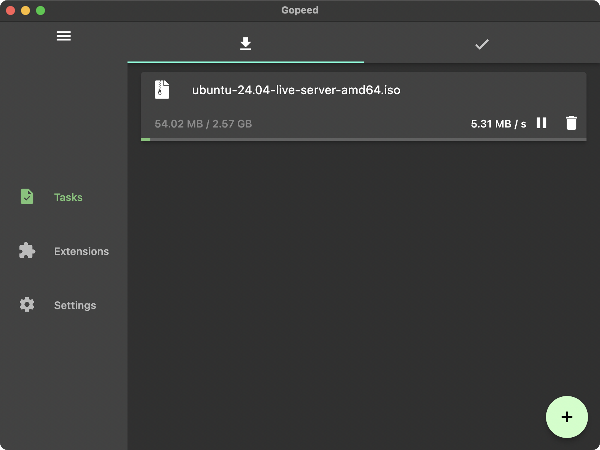

# [](https://gopeed.com)

[](https://github.com/GopeedLab/gopeed/actions?query=workflow%3Atest)
[](https://codecov.io/gh/GopeedLab/gopeed)
[](https://github.com/GopeedLab/gopeed/releases)
[](https://github.com/GopeedLab/gopeed/releases)
[](https://docs.gopeed.com/donate.html)
[](https://raw.githubusercontent.com/GopeedLab/gopeed/main/_docs/img/weixin.png)
[](https://discord.gg/ZUJqJrwCGB)

<a href="https://trendshift.io/repositories/7953" target="_blank"></a>

[](https://ko-fi.com/R6R6IJGN6)

[English](/README.md) | [中文](/README_zh-CN.md) | [日本語](/README_ja-JP.md) | [正體中文](/README_zh-TW.md) | [Tiếng Việt](/README_vi-VN.md)

## 🚀 Giới thiệu

Gopeed (tên đầy đủ Go Speed), một công cụ tải xuống tốc độ cao được phát triển bởi `Golang` + `Flutter`, hỗ trợ giao thức (HTTP, BitTorrent, Magnet) và hỗ trợ tất cả các nền tảng. Ngoài các chức năng tải xuống cơ bản, Gopeed còn là một công cụ tải xuống có thể tùy chỉnh cao cho phép triển khai thêm tính năng thông qua việc tích hợp với [APIs](https://docs.gopeed.com/dev-api.html) hoặc cài đặt và phát triển các [tiện ích mở rộng](https://docs.gopeed.com/dev-extension.html).

Truy cập ✈ [Trang web chính thức](https://gopeed.com) | 📖 [Tài liệu chính thức](https://docs.gopeed.com)

## ⬇️ Tải về

<table>
  <tbody>
    <tr>
      <td rowspan="2">🪟 Windows</td>
      <td><code>EXE</code></td>
      <td>amd64</td>
      <td><a href="https://gopeed.com/api/download?tpl=Gopeed-$version-windows-amd64.zip">📥</a></td>
    </tr>
    <tr>
      <td><code>Portable</code></td>
      <td>amd64</td>
      <td><a href="https://gopeed.com/api/download?tpl=Gopeed-$version-windows-amd64-portable.zip">📥</a></td>
    </tr>
    <tr>
      <td rowspan="3">🍎 MacOS</td>
      <td rowspan="3"><code>DMG</code></td>
      <td>universal</td>
      <td><a href="https://gopeed.com/api/download?tpl=Gopeed-$version-macos.dmg">📥</a></td>
    </tr>
    <tr>
      <td>amd64</td>
      <td><a href="https://gopeed.com/api/download?tpl=Gopeed-$version-macos-amd64.dmg">📥</a></td>
    </tr>
    <tr>
      <td>arm64</td>
      <td><a href="https://gopeed.com/api/download?tpl=Gopeed-$version-macos-arm64.dmg">📥</a></td>
    </tr>
    <tr>
      <td rowspan="6">🐧 Linux</td>
      <td><code>Flathub</code></td>
      <td>amd64</td>
      <td><a href="https://flathub.org/apps/com.gopeed.Gopeed">📥</a></td>
    </tr>
    <tr>
      <td><code>SNAP</code></td>
      <td>amd64</td>
      <td><a href="https://snapcraft.io/gopeed">📥</a></td>
    </tr>
    <tr>
      <td rowspan="2"><code>DEB</code></td>
      <td>amd64</td>
      <td><a href="https://gopeed.com/api/download?tpl=Gopeed-$version-linux-amd64.deb">📥</a></td>
    </tr>
    <tr>
      <td>arm64</td>
      <td><a href="https://gopeed.com/api/download?tpl=Gopeed-$version-linux-arm64.deb">📥</a></td>
    </tr>
    <tr>
      <td rowspan="2"><code>AppImage</code></td>
      <td>amd64</td>
      <td><a href="https://gopeed.com/api/download?tpl=Gopeed-$version-linux-amd64.AppImage">📥</a></td>
    </tr>
    <tr>
      <td>arm64</td>
      <td><a href="https://gopeed.com/api/download?tpl=Gopeed-$version-linux-arm64.AppImage">📥</a></td>
    </tr>
    <tr>
      <td rowspan="4">🤖 Android</td>
      <td rowspan="4"><code>APK</code></td>
      <td>universal</td>
      <td><a href="https://gopeed.com/api/download?tpl=Gopeed-$version-android.apk">📥</a></td>
    </tr>
     <tr>
      <td>armeabi-v7a</td>
      <td><a href="https://gopeed.com/api/download?tpl=Gopeed-$version-android-armeabi-v7a.apk">📥</a></td>
    </tr>
     <tr>
      <td>arm64-v8a</td>
      <td><a href="https://gopeed.com/api/download?tpl=Gopeed-$version-android-arm64-v8a.apk">📥</a></td>
    </tr>
    <tr>
      <td>x86_64</td>
      <td><a href="https://gopeed.com/api/download?tpl=Gopeed-$version-android-x86_64.apk">📥</a></td>
    </tr>
    <tr>
      <td>📱 iOS</td>
      <td><code>IPA</code></td>
      <td>universal</td>
      <td><a href="https://gopeed.com/api/download?tpl=Gopeed-$version-ios.ipa">📥</a></td>
    </tr>
    <tr>
      <td>🐳 Docker</td>
      <td>-</td>
      <td>universal</td>
      <td><a href="https://hub.docker.com/r/liwei2633/gopeed">📥</a></td>
    </tr>
    <tr>
      <td rowspan="2">💾 Qnap</td>
      <td rowspan="2"><code>QPKG</code></td>
      <td>amd64</td>
      <td><a href="https://gopeed.com/api/download?tpl=gopeed-$version-qnap-amd64.qpkg">📥</a></td>
    </tr>
    <tr>
      <td>arm64</td>
      <td><a href="https://gopeed.com/api/download?tpl=gopeed-$version-qnap-arm64.qpkg">📥</a></td>
    </tr>
    <tr>
      <td rowspan="8">🌐 Web</td>
      <td rowspan="3"><code>Windows</code></td>
      <td>amd64</td>
      <td><a href="https://gopeed.com/api/download?tpl=gopeed-web-$version-windows-amd64.zip">📥</a></td>
    </tr>
    <tr>
      <td>arm64</td>
      <td><a href="https://gopeed.com/api/download?tpl=gopeed-web-$version-windows-arm64.zip">📥</a></td>
    </tr>
    <tr>
      <td>386</td>
      <td><a href="https://gopeed.com/api/download?tpl=gopeed-web-$version-windows-386.zip">📥</a></td>
    </tr>
    <tr>
      <td rowspan="2"><code>MacOS</code></td>
      <td>amd64</td>
      <td><a href="https://gopeed.com/api/download?tpl=gopeed-web-$version-macos-amd64.zip">📥</a></td>
    </tr>
    <tr>
      <td>arm64</td>
      <td><a href="https://gopeed.com/api/download?tpl=gopeed-web-$version-macos-arm64.zip">📥</a></td>
    </tr>
    <tr>
      <td rowspan="3"><code>Linux</code></td>
      <td>amd64</td>
      <td><a href="https://gopeed.com/api/download?tpl=gopeed-web-$version-linux-amd64.zip">📥</a></td>
    </tr>
    <tr>
      <td>arm64</td>
      <td><a href="https://gopeed.com/api/download?tpl=gopeed-web-$version-linux-arm64.zip">📥</a></td>
    </tr>
    <tr>
      <td>386</td>
      <td><a href="https://gopeed.com/api/download?tpl=gopeed-web-$version-linux-386.zip">📥</a></td>
    </tr>
  </tbody>
</table>
Thêm thông tin về cài đặt, vui lòng tham khảo [Cài đặt](https://docs.gopeed.com/install.html)

### 🛠️ Công cụ lệnh

Sử dụng `go install`:

```bash
go install github.com/GopeedLab/gopeed/cmd/gopeed@latest
```

## 📱 WeChat Official Account

Theo dõi tài khoản chính thức để nhận các cập nhật và tin tức mới nhất.


## 💝 Quyên góp

Nếu bạn thích dự án này, xin vui lòng xem xét [quyên góp](https://docs.gopeed.com/donate.html) để hỗ trợ phát triển dự án này, cảm ơn bạn!

## 🖼️ Trưng bày



## 👨‍💻 Development

Dự án này được chia thành hai phần, phần giao diện sử dụng `flutter`, phần backend sử dụng `Golang`, và hai phía giao tiếp thông qua giao thức `http`. Trên hệ thống unix, sử dụng `unix socket`, và trên hệ thống windows, sử dụng giao thức `tcp`.

> Mã giao diện nằm trong thư mục `ui/flutter`.

### 🌍 Environment

1. Golang 1.23+
2. Flutter 3.24+

### 📋 Clone

```bash
git clone git@github.com:GopeedLab/gopeed.git
```

### 🤝 Đóng góp

Vui lòng tham khảo [CONTRIBUTING_vi-VN.md](/CONTRIBUTING_vi-VN.md)

### 🏗️ Xây dựng

#### Desktop

Trước tiên, bạn cần cấu hình môi trường theo tài liệu chính thức của [Tài liệu trang web máy tính để bàn Flutter](https://docs.flutter.dev/development/platform-integration/desktop), sau đó bạn cần đảm bảo môi trường cgo được thiết lập đúng. Để biết hướng dẫn chi tiết về cách thiết lập môi trường cgo, vui lòng tham khảo các tài liệu tương ứng có sẵn trực tuyến.

command:

- windows

```bash
go build -tags nosqlite -ldflags="-w -s" -buildmode=c-shared -o ui/flutter/windows/libgopeed.dll github.com/GopeedLab/gopeed/bind/desktop
cd ui/flutter
flutter build windows
```

- macos

```bash
go build -tags nosqlite -ldflags="-w -s" -buildmode=c-shared -o ui/flutter/macos/Frameworks/libgopeed.dylib github.com/GopeedLab/gopeed/bind/desktop
cd ui/flutter
flutter build macos
```

- linux

```bash
go build -tags nosqlite -ldflags="-w -s" -buildmode=c-shared -o ui/flutter/linux/bundle/lib/libgopeed.so github.com/GopeedLab/gopeed/bind/desktop
cd ui/flutter
flutter build linux
```

#### Mobile

Giống như trước đây, bạn cũng cần chuẩn bị môi trường `cgo` và sau đó cài đặt `gomobile`:

```bash
go install golang.org/x/mobile/cmd/gomobile@latest
go get golang.org/x/mobile/bind
gomobile init
```

command:

- android

```bash
gomobile bind -tags nosqlite -ldflags="-w -s -checklinkname=0" -o ui/flutter/android/app/libs/libgopeed.aar -target=android -androidapi 21 -javapkg="com.gopeed" github.com/GopeedLab/gopeed/bind/mobile
cd ui/flutter
flutter build apk
```

- ios

```bash
gomobile bind -tags nosqlite -ldflags="-w -s" -o ui/flutter/ios/Frameworks/Libgopeed.xcframework -target=ios github.com/GopeedLab/gopeed/bind/mobile
cd ui/flutter
flutter build ios --no-codesign
```

#### Web

command:

```bash
cd ui/flutter
flutter build web
cd ../../
rm -rf cmd/web/dist
cp -r ui/flutter/build/web cmd/web/dist
go build -tags nosqlite,web -ldflags="-s -w" -o bin/ github.com/GopeedLab/gopeed/cmd/web
```

## ❤️ Tín dụng

### Người đóng góp

<a href="https://github.com/GopeedLab/gopeed/graphs/contributors">
  
</a>

### JetBrains

[](https://www.jetbrains.com/?from=gopeed)

## Giấy phép

[GPLv3](LICENSE)
