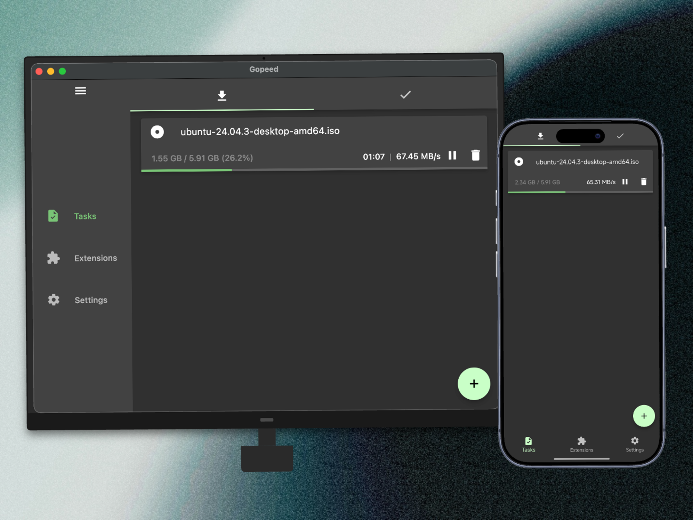

# [](https://gopeed.com)

[](https://github.com/GopeedLab/gopeed/actions?query=workflow%3Atest)
[](https://codecov.io/gh/GopeedLab/gopeed)
[](https://github.com/GopeedLab/gopeed/releases)
[](https://github.com/GopeedLab/gopeed/releases)
[](https://docs.gopeed.com/zh/donate.html)
[](https://raw.githubusercontent.com/GopeedLab/gopeed/main/_docs/img/weixin.png)
[](https://discord.gg/ZUJqJrwCGB)

<a href="https://trendshift.io/repositories/7953" target="_blank"></a>

[](https://ko-fi.com/R6R6IJGN6)

[English](/README.md) | [中文](/README_zh-CN.md) | [日本語](/README_ja-JP.md) | [正體中文](/README_zh-TW.md) | [Tiếng Việt](/README_vi-VN.md)

## 🚀 介绍

Gopeed（全称 Go Speed），直译过来中文名叫做`够快下载器`（不是狗屁下载器！），是一款由`Golang`+`Flutter`开发的高速下载器，支持（HTTP、BitTorrent、Magnet）协议下载，并且支持全平台使用。除了基本的下载功能外，Gopeed 还是一款高度可定制化的下载器，支持通过对接[APIs](https://docs.gopeed.com/zh/dev-api.html)或者安装和开发[扩展](https://docs.gopeed.com/zh/dev-extension.html)来实现更多的功能。

访问 ✈ [官方网站](https://gopeed.com/zh-CN) | 📖 [官方文档](https://docs.gopeed.com/zh/)

## ⬇️ 下载

<table>
  <tbody>
    <tr>
      <td rowspan="2">🪟 Windows</td>
      <td><code>EXE</code></td>
      <td>amd64</td>
      <td><a href="https://gopeed.com/api/download?tpl=Gopeed-$version-windows-amd64.zip">📥</a></td>
    </tr>
    <tr>
      <td><code>Portable</code></td>
      <td>amd64</td>
      <td><a href="https://gopeed.com/api/download?tpl=Gopeed-$version-windows-amd64-portable.zip">📥</a></td>
    </tr>
    <tr>
      <td rowspan="3">🍎 MacOS</td>
      <td rowspan="3"><code>DMG</code></td>
      <td>universal</td>
      <td><a href="https://gopeed.com/api/download?tpl=Gopeed-$version-macos.dmg">📥</a></td>
    </tr>
    <tr>
      <td>amd64</td>
      <td><a href="https://gopeed.com/api/download?tpl=Gopeed-$version-macos-amd64.dmg">📥</a></td>
    </tr>
    <tr>
      <td>arm64</td>
      <td><a href="https://gopeed.com/api/download?tpl=Gopeed-$version-macos-arm64.dmg">📥</a></td>
    </tr>
    <tr>
      <td rowspan="6">🐧 Linux</td>
      <td><code>Flathub</code></td>
      <td>amd64</td>
      <td><a href="https://flathub.org/apps/com.gopeed.Gopeed">📥</a></td>
    </tr>
    <tr>
      <td><code>SNAP</code></td>
      <td>amd64</td>
      <td><a href="https://snapcraft.io/gopeed">📥</a></td>
    </tr>
    <tr>
      <td rowspan="2"><code>DEB</code></td>
      <td>amd64</td>
      <td><a href="https://gopeed.com/api/download?tpl=Gopeed-$version-linux-amd64.deb">📥</a></td>
    </tr>
    <tr>
      <td>arm64</td>
      <td><a href="https://gopeed.com/api/download?tpl=Gopeed-$version-linux-arm64.deb">📥</a></td>
    </tr>
    <tr>
      <td rowspan="2"><code>AppImage</code></td>
      <td>amd64</td>
      <td><a href="https://gopeed.com/api/download?tpl=Gopeed-$version-linux-amd64.AppImage">📥</a></td>
    </tr>
    <tr>
      <td>arm64</td>
      <td><a href="https://gopeed.com/api/download?tpl=Gopeed-$version-linux-arm64.AppImage">📥</a></td>
    </tr>
    <tr>
      <td rowspan="4">🤖 Android</td>
      <td rowspan="4"><code>APK</code></td>
      <td>universal</td>
      <td><a href="https://gopeed.com/api/download?tpl=Gopeed-$version-android.apk">📥</a></td>
    </tr>
     <tr>
      <td>armeabi-v7a</td>
      <td><a href="https://gopeed.com/api/download?tpl=Gopeed-$version-android-armeabi-v7a.apk">📥</a></td>
    </tr>
     <tr>
      <td>arm64-v8a</td>
      <td><a href="https://gopeed.com/api/download?tpl=Gopeed-$version-android-arm64-v8a.apk">📥</a></td>
    </tr>
    <tr>
      <td>x86_64</td>
      <td><a href="https://gopeed.com/api/download?tpl=Gopeed-$version-android-x86_64.apk">📥</a></td>
    </tr>
    <tr>
      <td>📱 iOS</td>
      <td><code>IPA</code></td>
      <td>universal</td>
      <td><a href="https://gopeed.com/api/download?tpl=Gopeed-$version-ios.ipa">📥</a></td>
    </tr>
    <tr>
      <td>🐳 Docker</td>
      <td>-</td>
      <td>universal</td>
      <td><a href="https://hub.docker.com/r/liwei2633/gopeed">📥</a></td>
    </tr>
    <tr>
      <td rowspan="2">💾 Qnap</td>
      <td rowspan="2"><code>QPKG</code></td>
      <td>amd64</td>
      <td><a href="https://gopeed.com/api/download?tpl=gopeed-$version-qnap-amd64.qpkg">📥</a></td>
    </tr>
    <tr>
      <td>arm64</td>
      <td><a href="https://gopeed.com/api/download?tpl=gopeed-$version-qnap-arm64.qpkg">📥</a></td>
    </tr>
    <tr>
      <td rowspan="8">🌐 Web</td>
      <td rowspan="3"><code>Windows</code></td>
      <td>amd64</td>
      <td><a href="https://gopeed.com/api/download?tpl=gopeed-web-$version-windows-amd64.zip">📥</a></td>
    </tr>
    <tr>
      <td>arm64</td>
      <td><a href="https://gopeed.com/api/download?tpl=gopeed-web-$version-windows-arm64.zip">📥</a></td>
    </tr>
    <tr>
      <td>386</td>
      <td><a href="https://gopeed.com/api/download?tpl=gopeed-web-$version-windows-386.zip">📥</a></td>
    </tr>
    <tr>
      <td rowspan="2"><code>MacOS</code></td>
      <td>amd64</td>
      <td><a href="https://gopeed.com/api/download?tpl=gopeed-web-$version-macos-amd64.zip">📥</a></td>
    </tr>
    <tr>
      <td>arm64</td>
      <td><a href="https://gopeed.com/api/download?tpl=gopeed-web-$version-macos-arm64.zip">📥</a></td>
    </tr>
    <tr>
      <td rowspan="3"><code>Linux</code></td>
      <td>amd64</td>
      <td><a href="https://gopeed.com/api/download?tpl=gopeed-web-$version-linux-amd64.zip">📥</a></td>
    </tr>
    <tr>
      <td>arm64</td>
      <td><a href="https://gopeed.com/api/download?tpl=gopeed-web-$version-linux-arm64.zip">📥</a></td>
    </tr>
    <tr>
      <td>386</td>
      <td><a href="https://gopeed.com/api/download?tpl=gopeed-web-$version-linux-386.zip">📥</a></td>
    </tr>
  </tbody>
</table>
更多关于安装的内容请参考[安装文档](https://docs.gopeed.com/zh/install.html)

### 🛠️ 命令行工具

使用`go install`安装：

```bash
go install github.com/GopeedLab/gopeed/cmd/gopeed@latest
```

## 🔌 浏览器扩展

Gopeed 还提供了浏览器扩展用于接管浏览器下载，支持 Chrome、Edge、Firefox 等浏览器，具体请参考：[https://github.com/GopeedLab/browser-extension](https://github.com/GopeedLab/browser-extension)

## 📱 微信公众号

关注公众号获取项目最新动态和资讯。


## 💝 赞助

如果觉得项目对你有帮助，请考虑[赞助](https://docs.gopeed.com/zh/donate)以支持这个项目的发展，非常感谢！

## 🖼️ 界面展示



## 👨‍💻 开发

本项目分为前端和后端两个部分，前端使用`flutter`，后端使用`Golang`，两边通过`http`协议进行通讯，在 unix 系统下，使用的是`unix socket`，在 windows 系统下，使用的是`tcp`协议。

> 前端代码位于`ui/flutter`目录下。

### 🌍 环境要求

1. Golang 1.23+
2. Flutter 3.24+

### 📋 克隆项目

```bash
git clone git@github.com:GopeedLab/gopeed.git
```

### 🤝 贡献代码

请参考[贡献指南](CONTRIBUTING_zh-CN.md)

### 🏗️ 编译

#### 桌面端

首先需要按照[flutter desktop 官网文档](https://docs.flutter.dev/development/platform-integration/desktop)进行环境配置，然后需要准备好`cgo`环境，具体可以自行搜索。

构建命令：

- windows

```bash
go build -tags nosqlite -ldflags="-w -s" -buildmode=c-shared -o ui/flutter/windows/libgopeed.dll github.com/GopeedLab/gopeed/bind/desktop
cd ui/flutter
flutter build windows
```

- macos

```bash
go build -tags nosqlite -ldflags="-w -s" -buildmode=c-shared -o ui/flutter/macos/Frameworks/libgopeed.dylib github.com/GopeedLab/gopeed/bind/desktop
cd ui/flutter
flutter build macos
```

- linux

```bash
go build -tags nosqlite -ldflags="-w -s" -buildmode=c-shared -o ui/flutter/linux/bundle/lib/libgopeed.so github.com/GopeedLab/gopeed/bind/desktop
cd ui/flutter
flutter build linux
```

#### 移动端

同样的也是需要准备好`cgo`环境，接着安装`gomobile`：

```bash
go install golang.org/x/mobile/cmd/gomobile@latest
go get golang.org/x/mobile/bind
gomobile init
```

构建命令：

- android

```bash
gomobile bind -tags nosqlite -ldflags="-w -s -checklinkname=0" -o ui/flutter/android/app/libs/libgopeed.aar -target=android -androidapi 21 -javapkg="com.gopeed" github.com/GopeedLab/gopeed/bind/mobile
cd ui/flutter
flutter build apk
```

- ios

```bash
gomobile bind -tags nosqlite -ldflags="-w -s" -o ui/flutter/ios/Frameworks/Libgopeed.xcframework -target=ios github.com/GopeedLab/gopeed/bind/mobile
cd ui/flutter
flutter build ios --no-codesign
```

#### Web 端

构建命令：

```bash
cd ui/flutter
flutter build web
cd ../../
rm -rf cmd/web/dist
cp -r ui/flutter/build/web cmd/web/dist
go build -tags nosqlite,web -ldflags="-s -w" -o bin/ github.com/GopeedLab/gopeed/cmd/web
```

## ❤️ 感谢

### 贡献者

<a href="https://github.com/GopeedLab/gopeed/graphs/contributors">
  
</a>

### JetBrains

[](https://www.jetbrains.com/?from=gopeed)

## 开源许可

基于 [GPLv3](LICENSE) 协议开源。
