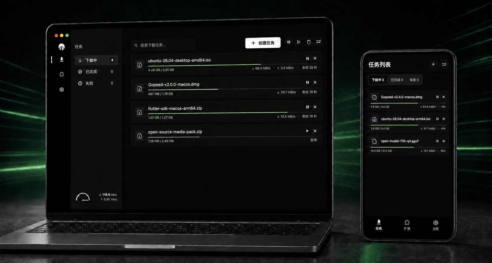

# [](https://gopeed.com)

[](https://github.com/GopeedLab/gopeed/actions?query=workflow%3Atest)
[](https://codecov.io/gh/GopeedLab/gopeed)
[](https://github.com/GopeedLab/gopeed/releases)
[](https://github.com/GopeedLab/gopeed/releases)
[](https://gopeed.com/docs/donate)
[](https://raw.githubusercontent.com/GopeedLab/gopeed/main/_docs/img/weixin.png)
[](https://discord.gg/ZUJqJrwCGB)

<a href="https://trendshift.io/repositories/7953" target="_blank"></a>

[English](/README.md) | [中文](/README_zh-CN.md) | [日本語](/README_ja-JP.md) | [正體中文](/README_zh-TW.md) | [Tiếng Việt](/README_vi-VN.md)

## 🚀 介绍

Gopeed（全称 **Go Speed**，也叫“够快下载器”）是一款使用 Go 和 Flutter 开发的高速、现代、免费开源下载器，支持 HTTP、HTTPS、BitTorrent、磁力链接和 ed2k，并覆盖桌面端、移动端与 Web。

除了日常下载任务管理，Gopeed 还提供浏览器接管、JavaScript 扩展、REST API、命令行工具和可自托管 Web UI，方便高级用户扩展和自动化自己的下载流程。

访问 ✈ [官方网站](https://gopeed.com)



## ✨ 主要特性

- ⚡ **高速下载** — 多任务并发、HTTP 多连接分段传输和 BitTorrent P2P 下载，充分利用可用带宽。
- 🧲 **多协议支持** — 在同一个界面管理 HTTP、HTTPS、BitTorrent、磁力链接和 ed2k。
- 🌱 **完整 BT 能力** — 支持 DHT 节点发现、uTP 传输、Web Seed、按文件选择下载、Tracker 管理、Peer/分片统计，以及按分享率或时间控制做种。
- 📋 **实用任务管理** — 暂停、续传、重试、批量操作、搜索、状态筛选、下载分类和启动恢复。
- 🪶 **轻量原生体验** — 主界面使用 Flutter 原生渲染，非 Electron，非 WebView 的套壳，安装包更轻量、运行开销更低、响应更流畅。
- 💻 **全平台覆盖** — 支持 Windows、macOS、Linux、Android、iOS 和 Web，并提供 Docker、QNAP 部署方式。
- 🎨 **个性化主题** — 支持跟随系统、浅色、深色三种模式，以及 8 种主题强调色。
- 📐 **响应式界面** — 任务列表、导航、设置和详情视图会针对手机、平板及可调整大小的桌面窗口自动布局。
- 🗣️ **20+ 种界面语言** — 支持简体中文、繁体中文、英语、日语、韩语等多种语言。
- 🌐 **浏览器接管** — 支持 Chrome、Edge、Firefox 等兼容浏览器，将下载任务直接发送到 Gopeed。
- 🧩 **JavaScript 扩展** — 扩展视频网站、AI 模型站、网盘等更多下载源。
- 🤖 **AI 接入** — 开放 MCP 接口，可接入 AI Agent，通过自然语言创建、查询和管理下载任务。
- 🔌 **开放接口** — 通过 REST API、CLI、带身份认证的 Web UI、Webhook 和下载后脚本进行自动化。
- 🛠️ **常用内置能力** — 自定义 Header 与 User-Agent、代理、GitHub 镜像、通知和自动解压。

## 🤖 AI 接入

将 Gopeed 接入 AI Agent 后，即可通过自然语言管理下载。例如，直接对 AI Agent 说：

> 帮我下载最新的 Gopeed Windows 客户端

| Tool | 功能说明 |
| --- | --- |
| `resolve_task` | 解析下载 URL 或 URI，在创建任务前返回资源信息及文件列表。 |
| `create_task` | 使用已解析的资源 ID 或直接下载请求创建并启动任务。 |
| `list_tasks` | 查询任务列表，并可按任务 ID 或状态筛选。 |
| `get_task` | 获取单个任务的请求、资源、选项及当前进度等完整信息。 |
| `get_task_status` | 获取单个任务的轻量运行状态和各文件下载进度。 |
| `get_task_stats` | 获取协议相关统计信息，包括 HTTP 连接或 BitTorrent Peer 与做种数据。 |
| `pause_task` | 暂停任务。 |
| `continue_task` | 继续已暂停或失败的任务。 |
| `delete_task` | 删除任务，并可选择同时删除已下载文件。 |

## ⬇️ 下载

### 🧪 Gopeed 2.0.0 Beta

Gopeed 2.0.0 目前处于公开 Beta 测试阶段，带来了全新的 2.0.0 使用体验，但部分功能仍可能不够完善或稳定。欢迎提前体验，并向我们反馈使用过程中遇到的问题。

- [下载 Gopeed 2.0.0 Beta 1](https://github.com/GopeedLab/gopeed/releases/tag/v2.0.0-beta.1)

当功能完整度和稳定性达到正式发布标准后，我们会发布 Gopeed 2.0.0 正式版。已安装 Beta 版本的用户可以直接升级到最终正式版，现有稳定版用户则不会被自动切换到 Beta 渠道。

### 正式稳定版

- [官方网站下载](https://gopeed.com)
- [GitHub Releases](https://github.com/GopeedLab/gopeed/releases/latest)

### 🛠️ 命令行工具

使用`go install`安装：

```bash
go install github.com/GopeedLab/gopeed/cmd/gopeed@latest
```

## 🔌 浏览器扩展

Gopeed 还提供了浏览器扩展用于接管浏览器下载，支持 Chrome、Edge、Firefox 等浏览器，具体请参考：[https://github.com/GopeedLab/browser-extension](https://github.com/GopeedLab/browser-extension)

## 📱 微信公众号

关注公众号获取项目最新动态和资讯。


## 💝 赞助

如果觉得项目对你有帮助，请考虑[赞助](https://gopeed.com/docs/donate)以支持这个项目的发展，非常感谢！

## 👨‍💻 开发

本项目分为前端和后端两个部分，前端使用`flutter`，后端使用`Golang`，两边通过`http`协议进行通讯，在 unix 系统下，使用的是`unix socket`，在 windows 系统下，使用的是`tcp`协议。

> 前端代码位于`ui/flutter`目录下。

### 🌍 环境要求

1. Golang 1.25+
2. Flutter 3.41+

### 📋 克隆项目

```bash
git clone git@github.com:GopeedLab/gopeed.git
```

### 🤝 贡献代码

请参考[贡献指南](CONTRIBUTING_zh-CN.md)

### 🏗️ 编译

#### 桌面端

首先需要按照[flutter desktop 官网文档](https://docs.flutter.dev/development/platform-integration/desktop)进行环境配置，然后需要准备好`cgo`环境，具体可以自行搜索。

构建命令：

- windows

```bash
go build -tags nosqlite -ldflags="-w -s" -buildmode=c-shared -o ui/flutter/windows/libgopeed.dll github.com/GopeedLab/gopeed/bind/desktop
cd ui/flutter
flutter build windows
```

- macos

```bash
go build -tags nosqlite -ldflags="-w -s" -buildmode=c-shared -o ui/flutter/macos/Frameworks/libgopeed.dylib github.com/GopeedLab/gopeed/bind/desktop
cd ui/flutter
flutter build macos
```

- linux

```bash
go build -tags nosqlite -ldflags="-w -s" -buildmode=c-shared -o ui/flutter/linux/bundle/lib/libgopeed.so github.com/GopeedLab/gopeed/bind/desktop
cd ui/flutter
flutter build linux
```

#### 移动端

同样的也是需要准备好`cgo`环境，接着安装`gomobile`：

```bash
go install golang.org/x/mobile/cmd/gomobile@latest
go get golang.org/x/mobile/bind
gomobile init
```

构建命令：

- android

```bash
gomobile bind -tags nosqlite -ldflags="-w -s -checklinkname=0" -o ui/flutter/android/app/libs/libgopeed.aar -target=android -androidapi 21 -javapkg="com.gopeed" github.com/GopeedLab/gopeed/bind/mobile
cd ui/flutter
flutter build apk
```

- ios

```bash
gomobile bind -tags nosqlite -ldflags="-w -s" -o ui/flutter/ios/Frameworks/Libgopeed.xcframework -target=ios github.com/GopeedLab/gopeed/bind/mobile
cd ui/flutter
flutter build ios --no-codesign
```

#### Web 端

构建命令：

```bash
cd ui/flutter
flutter build web
cd ../../
rm -rf cmd/web/dist
cp -r ui/flutter/build/web cmd/web/dist
go build -tags nosqlite,web -ldflags="-s -w" -o bin/ github.com/GopeedLab/gopeed/cmd/web
```

## ❤️ 感谢

### 贡献者

<a href="https://github.com/GopeedLab/gopeed/graphs/contributors">
  
</a>

### JetBrains

[](https://www.jetbrains.com/?from=gopeed)

## 开源许可

基于 [GPLv3](LICENSE) 协议开源。
