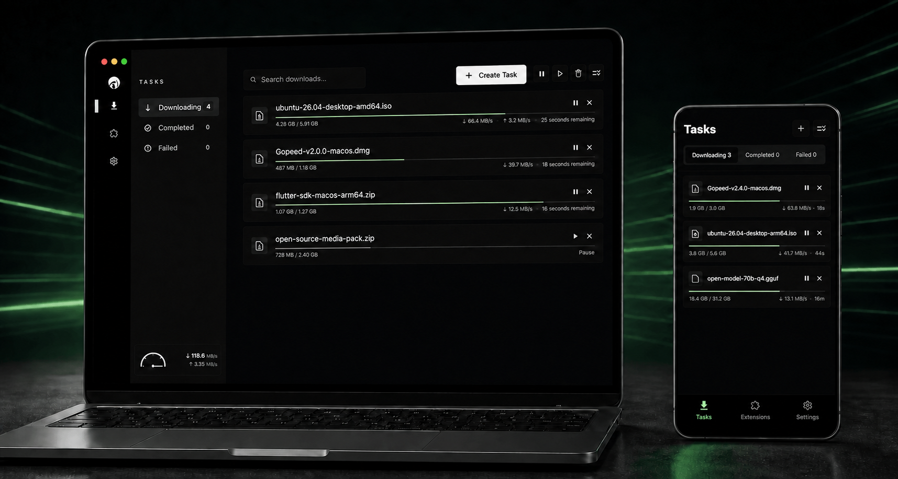

# [](https://gopeed.com)

[](https://github.com/GopeedLab/gopeed/actions?query=workflow%3Atest)
[](https://codecov.io/gh/GopeedLab/gopeed)
[](https://github.com/GopeedLab/gopeed/releases)
[](https://github.com/GopeedLab/gopeed/releases)
[](https://gopeed.com/docs/donate)
[](https://raw.githubusercontent.com/GopeedLab/gopeed/main/_docs/img/weixin.png)
[](https://discord.gg/ZUJqJrwCGB)

<a href="https://trendshift.io/repositories/7953" target="_blank"></a>

[English](/README.md) | [中文](/README_zh-CN.md) | [日本語](/README_ja-JP.md) | [正體中文](/README_zh-TW.md) | [Tiếng Việt](/README_vi-VN.md)

## 🚀 簡介

Gopeed（**Go Speed** 的縮寫）是一款以 Go 與 Flutter 開發的高速、現代化、免費開源下載器，支援 HTTP、HTTPS、BitTorrent、磁力連結與 ed2k，並涵蓋桌面、行動裝置及 Web。

除了日常任務管理，Gopeed 也提供瀏覽器整合、JavaScript 擴充、REST API、命令列工具及可自行託管的 Web UI，方便進階使用者擴充與自動化下載流程。

瀏覽 ✈ [官方網站](https://gopeed.com)



## ✨ 主要功能

- ⚡ **高速下載** — 多任務並行、HTTP 多連線分段傳輸與 BitTorrent P2P 下載，充分利用可用頻寬。
- 🧲 **多協定支援** — 在同一介面管理 HTTP、HTTPS、BitTorrent、磁力連結與 ed2k。
- 🌱 **完整 BT 功能** — 支援 DHT 節點探索、uTP 傳輸、Web Seed、逐檔選擇、Tracker 管理、Peer/分片統計，以及依分享率或時間控制做種。
- 📋 **實用任務管理** — 暫停、續傳、重試、批次操作、搜尋、狀態篩選、分類及啟動恢復。
- 🪶 **輕量原生體驗** — 主介面使用 Flutter 原生渲染，非 Electron，非 WebView 套殼，安裝包更輕量、執行開銷更低、操作回應更流暢。
- 💻 **跨平台** — 支援 Windows、macOS、Linux、Android、iOS、Web、Docker 與 QNAP。
- 🎨 **個人化主題** — 支援跟隨系統、淺色、深色模式及 8 種主題強調色。
- 📐 **響應式介面** — 任務列表、導覽、設定與詳細資訊會配合手機、平板及可調整大小的桌面視窗自動配置。
- 🗣️ **20+ 種介面語言** — 支援繁體中文、簡體中文、英文、日文、韓文等多種語言。
- 🌐 **瀏覽器整合** — 可接管 Chrome、Edge、Firefox 等相容瀏覽器的下載。
- 🧩 **JavaScript 擴充** — 新增影音網站、AI 模型平台、雲端儲存等下載來源。
- 🤖 **AI 整合** — 提供 MCP 介面，可串接相容的 AI Agent，以自然語言建立、查詢及管理下載任務。
- 🔌 **開放介面** — 支援 REST API、CLI、認證 Web UI、Webhook 及下載後腳本。
- 🛠️ **實用內建能力** — 自訂 Header/User-Agent、Proxy、GitHub 鏡像、通知及自動解壓縮。

## 🤖 AI 整合

將 Gopeed 與 AI Agent 串接後，即可透過自然語言管理下載。例如，直接對 AI Agent 說：

> 幫我下載最新的 Gopeed Windows 用戶端

| Tool | 功能說明 |
| --- | --- |
| `resolve_task` | 解析下載 URL 或 URI，在建立任務前回傳資源資訊及檔案清單。 |
| `create_task` | 使用已解析的資源 ID 或直接下載請求建立並啟動任務。 |
| `list_tasks` | 查詢任務清單，並可依任務 ID 或狀態篩選。 |
| `get_task` | 取得單一任務的請求、資源、選項及目前進度等完整資訊。 |
| `get_task_status` | 取得單一任務的簡要執行狀態及各檔案下載進度。 |
| `get_task_stats` | 取得協定相關統計資訊，包括 HTTP 連線或 BitTorrent Peer 與做種資料。 |
| `pause_task` | 暫停任務。 |
| `continue_task` | 繼續已暫停或失敗的任務。 |
| `delete_task` | 刪除任務，並可選擇同時刪除已下載檔案。 |

## ⬇️ 下載

### 🧪 Gopeed 2.0.0 Beta

Gopeed 2.0.0 目前處於公開 Beta 測試階段，帶來全新的 2.0.0 使用體驗，但部分功能仍可能不夠完善或穩定。歡迎搶先體驗，並向我們回報使用過程中遇到的問題。

- [下載 Gopeed 2.0.0 Beta 1](https://github.com/GopeedLab/gopeed/releases/tag/v2.0.0-beta.1)

當功能完整度與穩定性達到正式發布標準後，我們會發布 Gopeed 2.0.0 正式版。已安裝 Beta 版本的使用者可以直接升級至最終正式版，現有穩定版使用者則不會被自動切換至 Beta 頻道。

### 正式穩定版

- [官方網站下載](https://gopeed.com)
- [GitHub Releases](https://github.com/GopeedLab/gopeed/releases/latest)

### 🛠️ 使用 CLI 安裝

使用`go install`安裝：

```bash
go install github.com/GopeedLab/gopeed/cmd/gopeed@latest
```

## 📱 微信公眾號

關注公眾號獲取項目最新動態和資訊。


## 💝 贊助

如果你認為該項目對你有所幫助，請考慮[贊助](https://gopeed.com/docs/donate)以支持該項目的持續發展，謝謝！

## 👨‍💻 開發

該項目分為前端與後端，前端使用`flutter`編寫，後端使用`Golang`編寫，兩邊通過`http`協定進行通訊，在 unix 系統下，則使用`unix socket`，在 windows 系統下，則使用`tcp`協定。

> 前端代碼位於`ui/flutter`目錄內。

### 🌍 開發環境

1. Golang 1.25+
2. Flutter 3.41+

### 📋 克隆項目

```bash
git clone git@github.com:GopeedLab/gopeed.git
```

### 🤝 協助開發

請參考[協助指南](CONTRIBUTING_zh-TW.md)

### 🏗️ 編譯

#### 桌面端

首先需要按照[flutter desktop 官方文檔](https://docs.flutter.dev/development/platform-integration/desktop)配置開發環境，並準備好`cgo`環境，具體方法可以自行搜索。

組建指令：

- windows

```bash
go build -tags nosqlite -ldflags="-w -s" -buildmode=c-shared -o ui/flutter/windows/libgopeed.dll github.com/GopeedLab/gopeed/bind/desktop
cd ui/flutter
flutter build windows
```

- macos

```bash
go build -tags nosqlite -ldflags="-w -s" -buildmode=c-shared -o ui/flutter/macos/Frameworks/libgopeed.dylib github.com/GopeedLab/gopeed/bind/desktop
cd ui/flutter
flutter build macos
```

- linux

```bash
go build -tags nosqlite -ldflags="-w -s" -buildmode=c-shared -o ui/flutter/linux/bundle/lib/libgopeed.so github.com/GopeedLab/gopeed/bind/desktop
cd ui/flutter
flutter build linux
```

#### 移動設備

需要`cgo`環境，並安裝`gomobile`：

```bash
go install golang.org/x/mobile/cmd/gomobile@latest
go get golang.org/x/mobile/bind
gomobile init
```

組建指令：

- android

```bash
gomobile bind -tags nosqlite -ldflags="-w -s -checklinkname=0" -o ui/flutter/android/app/libs/libgopeed.aar -target=android -androidapi 21 -javapkg="com.gopeed" github.com/GopeedLab/gopeed/bind/mobile
cd ui/flutter
flutter build apk
```

- ios

```bash
gomobile bind -tags nosqlite -ldflags="-w -s" -o ui/flutter/ios/Frameworks/Libgopeed.xcframework -target=ios github.com/GopeedLab/gopeed/bind/mobile
cd ui/flutter
flutter build ios --no-codesign
```

#### 網頁端

組建指令：

```bash
cd ui/flutter
flutter build web
cd ../../
rm -rf cmd/web/dist
cp -r ui/flutter/build/web cmd/web/dist
go build -tags nosqlite,web -ldflags="-s -w" -o bin/ github.com/GopeedLab/gopeed/cmd/web
```

## ❤️ 感謝

### 貢獻者

<a href="https://github.com/GopeedLab/gopeed/graphs/contributors">
  
</a>

### JetBrains

[](https://www.jetbrains.com/?from=gopeed)

## 軟體許可

該軟體遵循 [GPLv3](LICENSE) 。
